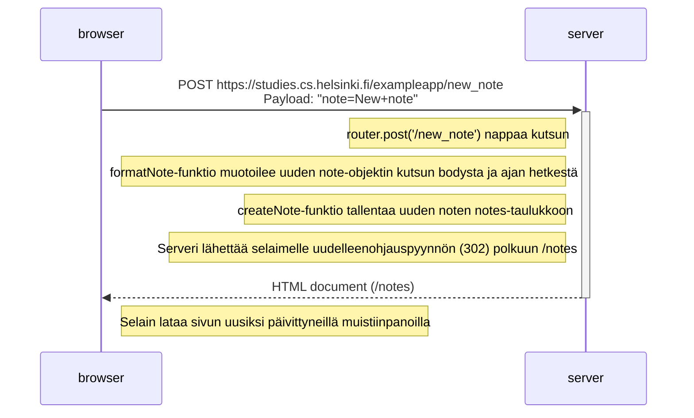
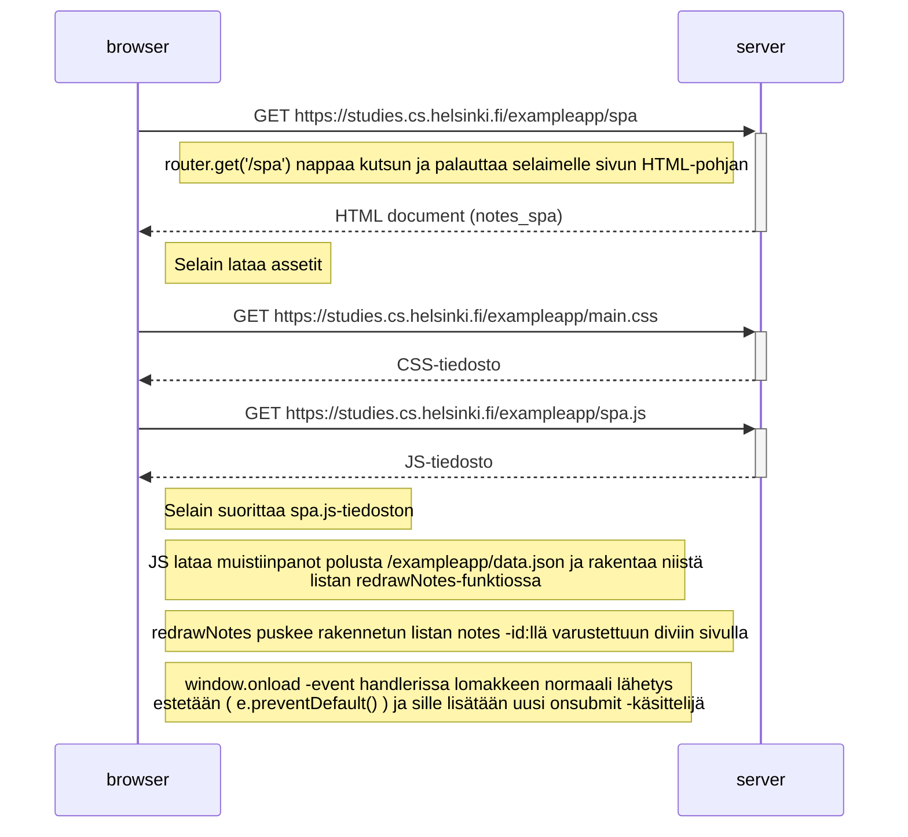
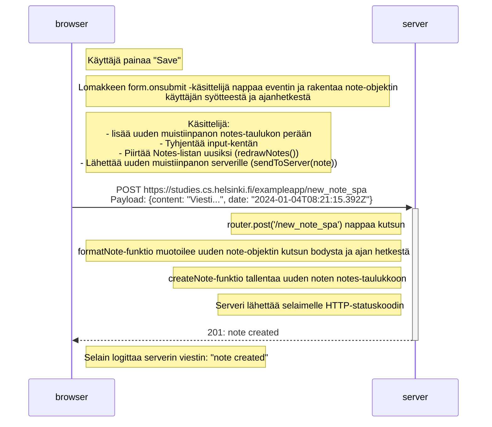

# Tehtävät

## 0.4: uusi muistiinpano

Tee vastaavanlainen kaavio, joka kuvaa, mitä tapahtuu tilanteessa, jossa käyttäjä luo uuden muistiinpanon ollessaan sivulla https://studies.cs.helsinki.fi/exampleapp/notes eli kirjoittaa tekstikenttään jotain ja painaa nappia tallenna.

Kirjoita tarvittaessa palvelimella tai selaimessa tapahtuvat operaatiot sopivina kommentteina kaavion sekaan.

## 0.5: Single Page App

Tee kaavio tilanteesta, jossa käyttäjä menee selaimella osoitteeseen https://studies.cs.helsinki.fi/exampleapp/spa eli muistiinpanojen Single Page App-versioon

## 0.6: Uusi muistiinpano

Tee kaavio tilanteesta, jossa käyttäjä luo uuden muistiinpanon single page ‑versiossa.

